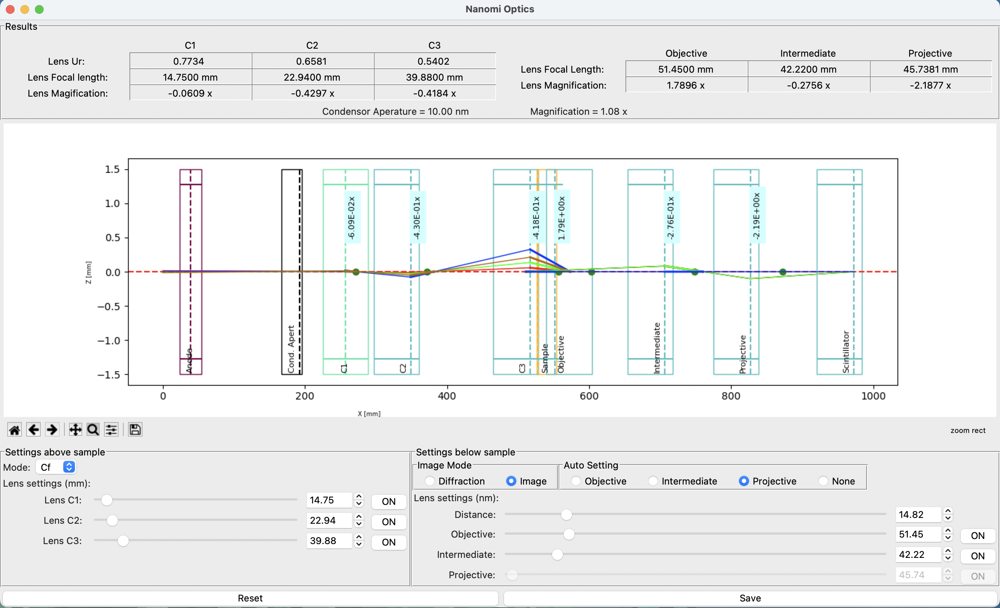
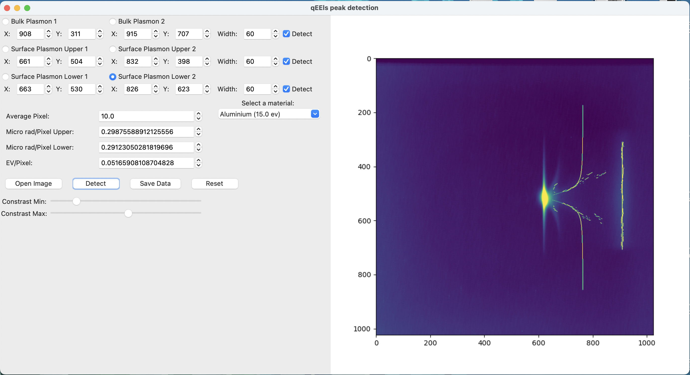

# COSC 499 Project 2 NRC Electron Microscope Tools

A set of Python tools re-written from Matlab for use with electron microscopes.

**Alignment Software:** Tomography image sequence alignent and tracking


**NanoMi Optics:** Optics diagram and optmization for Nanomi transmission electron microscope



**qEELS:** Momentum-resolved electron energy loss spectroscopy peak detection



## Documentation

- [Scope & Charter](./docs/scope-charter)
- [Design](./docs/design)
- [Communication](./docs/communication)
- [Weekly Logs](./docs/weekly%20logs)
- [Final](./docs/final)

## Team Members

- Garrett Cook
- Jasmine Mishra
- Jose Pena Revelo
- Lucas Towers

## Intro

Each software is its own python project. The following steps can be applied to
all projects.

## Windows Users Installation and Usage

1. Install a stable version of [Python 3](https://www.python.org/downloads/windows/) (must be >=3.9)
2. Extract the full source code to a folder on your device.
3. Run the `install.py` in a given project with python.
4. Run the `main.py` in a given project with python.

## Mac/Linux Installation and Usage

1. Install a stable version of Python 3 (must be >=3.9), using a package manager such as `brew` or `apt` is recommended.
   - `brew install python@3.9`
   - `sudo apt install python3.9`
2. Install supporting libraries for Tcl/Tk
   - `brew install python-tk`
   - `sudo apt install python3-tk`
3. Extract the full source code to a directory on your device.
4. Run the project's `install.py` with python.
5. Run the project's `main.py` with python.

## Run via command line

```shell
python -m qeels
python -m nanomi_optics
python -m alignment_software
```

## Advanced Development Instructions

1. Install [Poetry](https://python-poetry.org/docs/#installation) for Python
2. Clone the repository and `cd` into one of three projects directories
3. Install dependencies with `poetry install`
4. Enter a virtual shell with `poetry shell`
5. Run tests with `pytest`
6. Lint code with `flake8 <package_name>`
